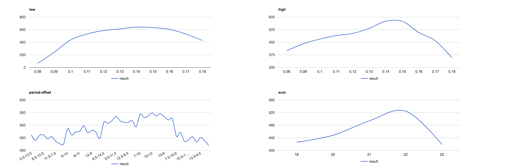
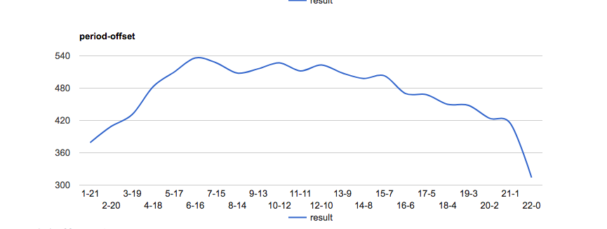

Running 5445 tests
03:10:16 web.1   |  Should be about 816.75-871.20 seconds.
03:24:17 web.1   |  Took 840.71 seconds. (about 0.15 seconds each)

ETH

Analyzing 2795 values (19.41 days)
- sell_all: true
- buy_sell_method: 'avg'
- buy_sell_unit: 200
- buy_limit: 2000
- simulate_crash: false

average value of table:
period-offset_5.5-13.5: 462
sum_19: 426
period-offset_6.5-12.5: 440
period-offset_7.5-11.5: 459
period-offset_8.5-10.5: 462
period-offset_9.5-9.5: 446
period-offset_10.5-8.5: 455
period-offset_11.5-7.5: 437
period-offset_12.5-6.5: 427
period-offset_13.5-5.5: 426
period-offset_6-14: 486
sum_20: 448
period-offset_7-13: 461
period-offset_8-12: 473
period-offset_9-11: 476
period-offset_10-10: 498
period-offset_11-9: 470
period-offset_12-8: 480
period-offset_13-7: 473
period-offset_14-6: 448
period-offset_6.5-14.5: 512
sum_21: 494
period-offset_7.5-13.5: 507
period-offset_8.5-12.5: 518
period-offset_9.5-11.5: 535
period-offset_10.5-10.5: 518
period-offset_11.5-9.5: 512
period-offset_12.5-8.5: 511
period-offset_13.5-7.5: 519
period-offset_14.5-6.5: 494
period-offset_7-15: 544
sum_22: 525
period-offset_8-14: 530
period-offset_9-13: 538
period-offset_10-12: 549
period-offset_11-11: 537
period-offset_12-10: 546
period-offset_13-9: 533
period-offset_14-8: 521
period-offset_15-7: 525
period-offset_7.5-15.5: 456
sum_23: 419
period-offset_8.5-14.5: 471
period-offset_9.5-13.5: 436
period-offset_10.5-12.5: 442
period-offset_11.5-11.5: 454
period-offset_12.5-10.5: 433
period-offset_13.5-9.5: 451
period-offset_14.5-8.5: 439
period-offset_15.5-7.5: 419

global averages:
high_0.08: 400
low_0.08: 65
high_0.09: 441
high_0.1: 469
high_0.11: 490
high_0.12: 503
high_0.13: 533
high_0.14: 576
high_0.15: 575
high_0.16: 508
high_0.17: 459
high_0.18: 358
low_0.09: 239
low_0.1: 437
low_0.11: 532
low_0.12: 587
low_0.13: 612
low_0.14: 641
low_0.15: 634
low_0.16: 605
low_0.17: 531
low_0.18: 428

running full test for 22 --- with  0.5 hrs incremetns
Screen Shot 2017-07-15 at 10.58.15 AM
(same as aobve but twice as many values )